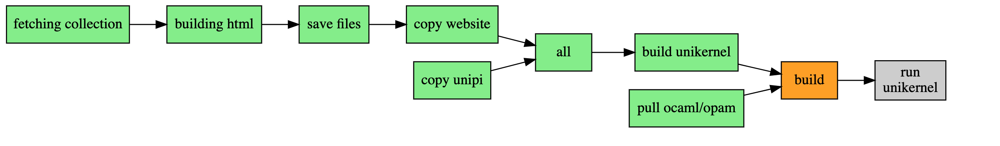

patricoferris-www
-----------------

An [ocurrent](https://github.com/ocurrent/ocurrent)-powered, website pipeline using [current-sesame](https://github.com/patricoferris/sesame) and the [unipi unikernel](https://github.com/roburio/unipi). Disclaimer: you're probably seeing this way before it is ready/nice/working... I changed my mind half way through to actually use the Irmin part of unipi but haven't updated any of the docs yet. The code is very poorly written and the different modes are undocumented too (dev-server, dev-unikernel, git-redeploy, gcloud-deploy etc.)

*Pipeline probably not accurate!*

If you are interested in understanding more about this project, why not have a read of (the probably not live at the moment and certainly not up to date) ["An incremental, unikernel-deploying website pipeline"](https://patricoferris.com/posts/site).
