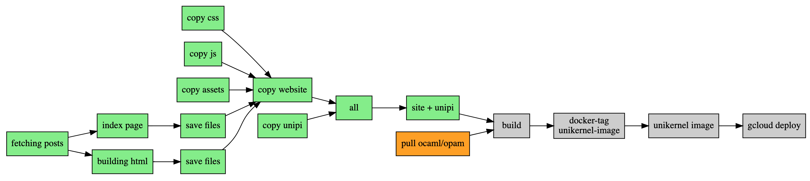

patricoferris-www
-----------------

An [ocurrent](https://github.com/ocurrent/ocurrent)-powered, website pipeline using [current-sesame](https://github.com/patricoferris/sesame) and the [unipi unikernel](https://github.com/roburio/unipi). 

If you are interested in understanding more about this project, why not have a read of ["An incremental, unikernel-deploying website pipeline"](https://patricoferris.com/posts/site/index.html).
